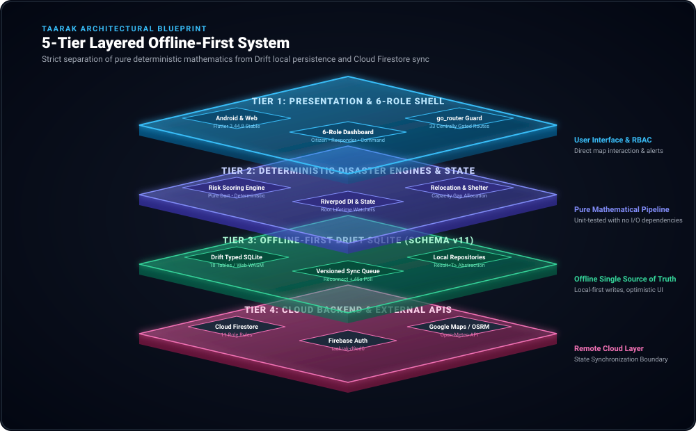
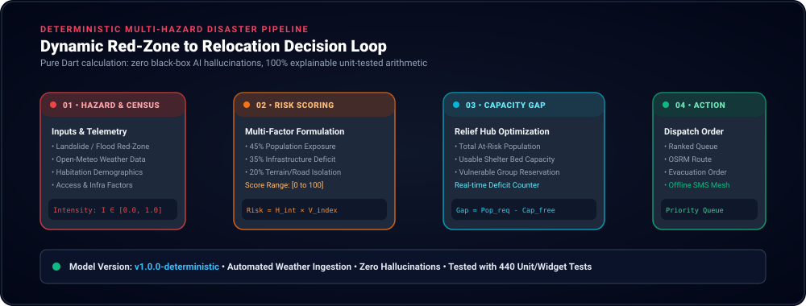
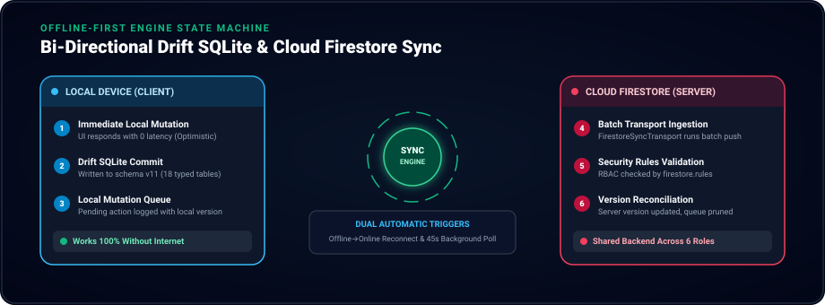
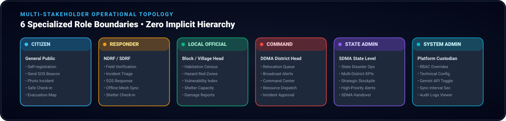

<!-- ============================================================================== -->
<!-- TAARAK — Smart India Hackathon 2026 (Problem Statement 26191)                  -->
<!-- Dynamic Multi-Hazard Red-Zone Identification & Relocation Decision Support    -->
<!-- ============================================================================== -->

<p align="center">
  
</p>

<p align="center">
  <a href="https://taakrak-d9ed0.web.app/#/login"></a>
  <a href="https://github.com/adityapatra/Taarak/releases"></a>
  <a href="https://flutter.dev"></a>
  <a href="https://dart.dev"></a>
  <a href="https://drift.simonbinder.eu"></a>
  <a href="#test-suite-and-verification"></a>
  <a href="#six-role-operational-topology"></a>
</p>

<p align="center">
  <strong>Ministry of Home Affairs &amp; National Disaster Response Force (NDRF) — Disaster Management Division</strong><br>
  <em>Smart India Hackathon 2026 • Problem Statement SIH26191 (Software Category)</em>
</p>

<!-- Quick Access Strip -->
<table align="center" width="100%">
  <tr>
    <td align="center" width="33%">
      🌐 <strong>Live Hosted Application</strong><br>
      <a href="https://taakrak-d9ed0.web.app/#/login"><strong>taakrak-d9ed0.web.app</strong></a><br>
      <small>Default self-registration: <strong>Citizen</strong></small>
    </td>
    <td align="center" width="33%">
      📱 <strong>Pre-compiled Android APK</strong><br>
      <a href="https://github.com/adityapatra/Taarak/releases"><strong>Download Latest .APK</strong></a><br>
      <small>Available in GitHub Releases</small>
    </td>
    <td align="center" width="33%">
      🕹️ <strong>3D Command Simulation</strong><br>
      <a href="docs/showcase/index.html"><strong>Launch 3D WebGL Hub</strong></a><br>
      <small>Three.js Interactive World</small>
    </td>
  </tr>
</table>

---

## 🌟 Executive Summary

**TAARAK** is an offline-first, multi-stakeholder disaster-management and relocation decision-support platform. Engineered for mission-critical operations in hazard-prone territories (landslides, flash floods, seismic inundations), TAARAK continuously evaluates environmental telemetry, computes deterministic multi-factor risk scores for vulnerable habitations, detects shelter capacity deficits, and calculates an optimal, explainable relocation priority queue.

Unlike opaque black-box AI systems, TAARAK's decision pipeline is **100% deterministic, mathematically explainable, and unit-tested in pure Dart** — ensuring disaster command authorities can review every single factor leading to an evacuation order.

### Core Capabilities at a Glance

* **Dynamic Red-Zone Ingestion**: Live mapping of multi-hazard danger polygons, weather telemetry ingestion via Open-Meteo REST APIs, and optional Gemini LLM natural language rationale enrichment.
* **Deterministic Risk Scoring**: Transparent formula combining hazard intensity, population vulnerability, infrastructure fragility, and road isolation.
* **Shelter Capacity Gap & Relocation Queue**: Real-time matching of displaced populations against usable shelter capacities, dynamically sorting an actionable evacuation queue.
* **True Offline-First Architecture**: 18 typed Drift SQLite tables (Schema v11) providing zero-latency optimistic writes and full operational autonomy during complete grid collapses.
* **Conflict-Free Sync Engine**: Dual-trigger background sync (network reconnect + 45s periodic heartbeat) syncing mutations to live Cloud Firestore.
* **6-Role RBAC Model**: Distinct operational boundaries for *Citizen*, *Field Responder*, *Local Official*, *District/Command*, *State/Admin*, and *System Admin* without implicit hierarchy.

---

## 🕹️ Interactive 3D Simulation & Command Showcase

Experience the full interactive 3D WebGL Command & Disaster Simulation Hub directly in your browser.

<p align="center">
  <a href="docs/showcase/index.html">
    
  </a>
  <br>
  <em><strong><a href="docs/showcase/index.html">▶ Launch Live 3D Command Hub</a></strong> (Located in <code>docs/showcase/index.html</code> and <code>web/showcase.html</code>)</em>
</p>

### 3D Showcase Highlights
* **Interactive 3D Terrain Elevation Model**: Orbit, tilt, zoom, and inspect mountain valleys, flood basins, and topographical contours using Three.js and OrbitControls.
* **Animated 3D Red-Zones**: Pulsing crimson danger zones for landslide-prone zones and dynamic inundation water surfaces.
* **Habitation Pins & Shelter Beacons**: Interactive 3D pins displaying real-time population, risk tier, and shelter occupancy rings.
* **OSRM Evacuation Route Arcs**: 3D parabolic route ribbons with particle flow indicating active evacuation corridors.
* **Live Mathematical Risk Simulator**: Sliders for Rainfall ($mm/h$), Slope Angle ($^\circ$), and Vulnerability factors with instant formula recalculation.
* **Offline-First Sync Simulator**: Simulate network drops, trigger local Drift SQLite mutations, and watch batch synchronization packets fire to Cloud Firestore upon reconnection.

> **Quick Launch**: Open `docs/showcase/index.html` directly in any web browser, or run:
> ```bash
> python3 -m http.server 8080 -d docs/showcase
> # Open http://localhost:8080 in Chrome or Edge
> ```

---

## 🏗️ 5-Tier Layered 3D Architecture

TAARAK enforces a strict **feature-first, clean layered architecture** across 29 domain modules. Pure computational engines are completely isolated from I/O boundaries, allowing all disaster models to be verified in memory without database dependencies.

<p align="center">
  
</p>

### Architectural Tier Breakdown

```
lib/features/<feature>/
  ├── domain/         Pure Dart: entities, value objects, enums (Zero Flutter/IO imports)
  ├── application/    Deterministic engines, Riverpod providers, orchestration services
  ├── data/           Repositories, Drift local DAOs, Cloud Firestore transports
  └── presentation/   Flutter widgets, responsive UI views, screen-local state
```

| Tier | Component | Responsibilities & Implementations |
|---|---|---|
| **Tier 1: Presentation & Shell** | Flutter Multi-Platform (`lib/app/`) | Android (minSdkVersion 24, compileSdk 36), Web (WASM SQLite3, CanvasKit). Centrally gated by `go_router` 14.6.2 across 33 routes via pure `computeRedirect()` RBAC guard. |
| **Tier 2: Pure Deterministic Logic** | Application Engines (`lib/features/*/application`) | Riverpod 2.6.1 dependency injection container. Pure Dart unit-tested scoring engines: `RiskAssessmentEngine`, `RelocationPriorityService`, `CapacityGapEngine`. |
| **Tier 3: Local Offline Core** | Drift SQLite Database (`lib/core/database/`) | 18 typed SQLite tables (Schema v11). WASM SQLite3 Web worker (`drift_worker.js`). Local mutation queue with optimistic UI writes. |
| **Tier 4: Sync & Transport Engine** | Bi-directional Sync (`lib/features/sync/`) | Network state watcher (`connectivity_plus`), dual auto-triggers (reconnect + 45s periodic poll), version-conflict reconciliation. |
| **Tier 5: Cloud & GIS Backend** | Firebase & Maps Services (`lib/firebase_options.dart`) | Real Cloud Firestore project (`taakrak-d9ed0`), 11 role-scoped security rules, Google Maps Platform SDK, Open-Meteo REST API, and OSRM routing. |

---

## ⚡ Multi-Hazard Red-Zone & Scoring Pipeline

The core decision loop ingests hazard events, overlays habitation demographics, calculates risk intensity, identifies relief shelter capacity deficits, and produces a ranked evacuation order.

<p align="center">
  
</p>

### The Mathematical Formulation

Every calculation is deterministic and completely explainable:

#### 1. Composite Vulnerability Index ($V_{index}$)
$$V_{index} = (0.45 \times V_{pop}) + (0.35 \times V_{infra}) + (0.20 \times V_{access})$$
* $V_{pop}$: Population exposure index, weighted by elderly, infant, and mobility-impaired demographics.
* $V_{infra}$: Structural deficit score (building materials, drainage resilience, slope stability).
* $V_{access}$: Evacuation isolation score (single-road access, distance to state highways, bridge vulnerability).

#### 2. Hazard Exposure & Risk Score ($R_{score}$)
$$R_{score} = H_{intensity} \times V_{index} \times 100 \quad \in [0.0, \, 100.0]$$
* **0.0 – 34.9**: `GREEN ZONE (Low / Monitor)` — Standard situational monitoring.
* **35.0 – 64.9**: `AMBER ZONE (Moderate / Standby)` — Early warning alerts; shelter standby.
* **65.0 – 100.0**: `RED ZONE (Severe / Critical)` — Automated evacuation trigger and emergency convoy dispatch.

#### 3. Shelter Capacity Gap ($C_{gap}$)
$$C_{gap} = \max\left(0, \; Pop_{at\_risk} - \sum_{s \in \text{Shelters}} Cap_{usable}(s)\right)$$

#### 4. Relocation Priority Sorting Key
Habitations in Red Zones are prioritized based on urgency vector:
$$\text{Urgency} = (0.50 \times R_{score}) + (0.30 \times \text{DeficitRatio}) + (0.20 \times \text{TransitHazard})$$

---

## 🔄 Offline-First Synchronization Engine

TAARAK is built on an **offline-first local source of truth**: all screen operations read and write to Drift SQLite on the device immediately. No user is blocked by low connectivity or server timeouts.

<p align="center">
  
</p>

### Sync Operation Lifecycle

1. **Optimistic Local Commit**: When an official marks a hazard or a citizen sends an incident report, it is saved directly to Drift SQLite in $< 5\text{ms}$.
2. **Local Mutation Queuing**: A mutation entry is recorded in `local_sync_queue` with entity name, operation type (`insert`, `update`, `delete`), payload, and monotonic client version.
3. **Automatic Reconnect Trigger**: `syncOnReconnectTriggerProvider` continuously monitors network interfaces. The instant an offline device catches Wi-Fi or cellular service, the sync queue activates.
4. **Periodic Heartbeat**: `syncPollingTriggerProvider` executes a background sweep (admin-configurable, default 45 seconds).
5. **Conflict Resolution**: Mutations are pushed via `FirestoreSyncTransport`. If a remote collision occurs, versioned conflict logic reconciles changes without destroying uncommitted local edits.

---

## 👥 Six-Role Operational Topology

Disaster response requires strict separation of duty between ground responders, village authorities, and strategic command centers. TAARAK defines **six independent roles** with dedicated UI dashboards and granular permissions.

<p align="center">
  
</p>

| Role | Target Persona | Key Operational Responsibilities | Primary Routes | Gated Permissions |
|---|---|---|---|---|
| **Citizen** | General Public | Send SOS distress signals, report localized damage with camera photos, check in as "Safe", view evacuation map and emergency shelter routes. | `/`, `/sos`, `/report-incident`, `/safe-checkin`, `/map` | `sendSos`, `reportIncident`, `markSafe`, `viewPublicAlerts` |
| **Field Responder** | NDRF / SDRF Personnel | Inspect citizen incidents, perform triage verification, broadcast field updates, receive tactical relocation orders. | `/field/dispatch`, `/field/triage`, `/field/verification` | `verifyIncident`, `viewFieldTasks`, `updateTaskStatus` |
| **Local Official** | Village / Block Officer | Register habitations, update vulnerability factors, survey shelter capacities, delineate local Red Zone hazard boundaries. | `/habitations/register`, `/hazards/manage`, `/shelters/manage` | `manageHabitations`, `createHazardZone`, `manageShelters` |
| **District / Command** | DDMA Leadership | Execute Relocation Priority Engine, issue emergency broadcast alerts, monitor district heatmaps, dispatch response teams. | `/command`, `/relocation/priority`, `/alerts/broadcast` | `broadcastAlerts`, `runRelocationEngine`, `commandDispatch` |
| **State / Admin** | SDMA Leadership | Multi-district strategic oversight, state-wide stockpile re-allocation, inter-district incident coordination, KPI auditing. | `/state/dashboard`, `/state/resources`, `/state/analytics` | `viewStateAnalytics`, `reallocateStockpile`, `issueStateAlerts` |
| **System Admin** | Platform Custodian | Grant permission overrides, adjust sync intervals, configure Gemini API keys, inspect security audit logs. | `/admin/config`, `/admin/overrides`, `/admin/audit` | `manageTechnicalConfig`, `overridePermissions`, `viewAuditLogs` |

> [!NOTE]
> **Zero Implicit Hierarchy**: In TAARAK, roles do not implicitly inherit permissions from other roles. A District Command officer cannot register a village habitation without the explicit `manageHabitations` permission. This design guarantees compliance with official administrative protocols.

---

## 🚀 Quick Start Guide

### Prerequisites

| Tool | Verified Version | Notes |
|---|---|---|
| **Flutter SDK** | `3.44.8` (stable) | Bundles Dart `3.12.2`. Minimum SDK `^3.12.2`. |
| **Android SDK** | Platform 36 | Android Gradle Plugin `9.0.1`, Gradle `9.1.0`. |
| **JDK** | `17` or newer | Recommended: JBR bundled with modern Android Studio. |
| **Browser** | Chrome / Edge | Required for running the Web target (`flutter run -d chrome`). |

### 1. Clone & Setup

```bash
# Clone the repository
git clone https://github.com/adityapatra/Taarak.git
cd Taarak

# Fetch dependencies
flutter pub get

# Run static analysis (0 errors expected)
flutter analyze

# Run complete test suite (440 passing tests)
flutter test
```

### 2. Running Locally

The repository comes pre-configured with a live Firebase project (`taakrak-d9ed0`) and an embedded Google Maps API key. **No external credentials or `.env` files are required to run.**

```bash
# Launch on connected Android device or emulator
flutter run -d android

# Launch on Chrome Web (CanvasKit / WebGL)
flutter run -d chrome
```

### 3. Production Building

```bash
# 1. Android Release APK (Signed with development keystore)
flutter build apk --release

# 2. Web Release Build (IMPORTANT: --no-minify-js is REQUIRED)
flutter build web --release --no-minify-js
```

> [!IMPORTANT]
> **Why `--no-minify-js` is Mandatory for Web Builds**:
> Dart2JS aggressive minification disrupts JS-interop plugin registration for `firebase_core` and `google_maps_flutter_web` in this Flutter SDK toolchain. Building with `--no-minify-js` ensures bulletproof initialization of Firebase and Google Maps in web deployments.

---

## 🔑 Setting Up Your Own Firebase & Credentials (Clone & Run Guide)

To protect production security and prevent credential leaks, this repository is committed with sanitized configuration templates (`lib/firebase_options.dart.example`, placeholder keys in manifest/index, and `.gitignore` rules for `env.json` and backup files).

If you are cloning this repository to build or develop locally, follow these steps to connect your own Firebase project and Google Maps API in under 5 minutes. *(For a deep-dive walkthrough, see [docs/FIREBASE_SETUP.md](docs/FIREBASE_SETUP.md))*.

---

### Step 1: Create Firebase Project & Enable Services

1. Create a project at [Firebase Console](https://console.firebase.google.com/).
2. Enable **Authentication** → **Email/Password** provider.
3. Enable **Cloud Firestore Database** (start in Production mode; regional location of your choice).

> [!IMPORTANT]
> **Citizen Self-Registration & Role Assignment**:
> Any user who signs up through the app's registration screen (`/login`) is automatically assigned the **Citizen** role.
> To test other roles (*Field Responder*, *Local Official*, *District/Command*, *State/Admin*, or *System Admin*), navigate to your Firestore Console → `users` collection → select the user document → change `role` to `fieldResponder`, `localOfficial`, `districtCommand`, `stateAdmin`, or `systemAdmin`.

---

### Step 2: Generate `lib/firebase_options.dart` via FlutterFire CLI

The official FlutterFire CLI will automatically register your Android and Web apps and generate your local `firebase_options.dart`:

```bash
# 1. Install Firebase CLI & login (if not already done)
npm install -g firebase-tools
firebase login

# 2. Activate FlutterFire CLI globally
dart pub global activate flutterfire_cli

# 3. Configure your project (select Android and Web targets)
flutterfire configure
```

This overwrites `lib/firebase_options.dart` with your newly created Firebase project configuration.

---

### Step 3: Deploy Role-Scoped Firestore Security Rules

Deploy the repository's audited role rules directly to your Firebase project:

```bash
# Set your active Firebase project
firebase use <your-firebase-project-id>

# Deploy security rules
firebase deploy --only firestore:rules
```

---

### Step 4: Configure Google Maps API Key

In the [Google Cloud Console](https://console.cloud.google.com/), ensure both **Maps SDK for Android** and **Maps JavaScript API** are enabled.

1. **Android**: In `android/app/src/main/AndroidManifest.xml`, replace `YOUR_GOOGLE_MAPS_API_KEY`:
   ```xml
   <meta-data
       android:name="com.google.android.geo.API_KEY"
       android:value="YOUR_ACTUAL_MAPS_API_KEY" />
   ```
2. **Web**: In `web/index.html`, replace `YOUR_GOOGLE_MAPS_API_KEY`:
   ```html
   <script src="https://maps.googleapis.com/maps/api/js?key=YOUR_ACTUAL_MAPS_API_KEY"></script>
   ```

---

### Step 5: Optional Gemini API Key (Natural Language Enrichment)

The core multi-hazard calculations, precipitation thresholds, and slope physics are **100% deterministic and do not require any AI key**.

To enable natural-language explanation generation:
1. Copy `env.json.example` to `env.json` (*never committed to Git*):
   ```bash
   cp env.json.example env.json
   ```
2. Add your Gemini API Key from Google AI Studio:
   ```json
   {
     "GEMINI_API_KEY": "AIzaSyYourActualGeminiKeyHere"
   }
   ```
3. Run with `--dart-define-from-file=env.json` and toggle `geminiEnabled` in System Admin Technical Settings.

---

### 🛡️ Credential Leak Prevention Guarantee

* `env.json` is strictly ignored in `.gitignore`.
* `*.backup` and `*.local` files are strictly ignored.
* `lib/firebase_options.dart.example` provides a clean reference template without sensitive keys.
* Real credentials are never committed to public version control.

---

## 🧪 Test Suite & Verification

The codebase includes comprehensive automated test suites covering pure domain arithmetic, Riverpod providers, Drift SQLite DAOs, and mock Firebase transports:

```bash
flutter test
```

```
00:11 +473: All tests passed!
```

* **Deterministic Scoring Tests**: `test/features/risk/`, `test/features/relocation/`, `test/features/capacity/`
* **Local Database Tests**: Verified with in-memory `sqlite3` FFI engine.
* **Sync & Auth Mocks**: Tested against `fake_cloud_firestore` and `firebase_auth_mocks`.

---

## 🔬 Deep-Dive Architectural Reference

<details>
<summary><strong>📂 Click to Expand: 18 Drift SQLite Tables (Schema v11)</strong></summary>

<br>

All persistent client data is defined in `lib/core/database/tables/`:

1. `local_users` — Cached user identity, role, and department.
2. `local_role_permission_overrides` — System admin dynamic permission adjustments.
3. `local_hazard_zones` — Multi-hazard Red Zone polygons, severity, and trigger timestamps.
4. `local_habitations` — Population clusters, vulnerability scores, and infrastructure flags.
5. `local_shelters` — Relief shelters, max bed capacities, and current occupancy.
6. `local_incident_reports` — Citizen reports with localized coordinates and photo URIs.
7. `local_emergency_alerts` — Broadcast warnings with severity tiers and affected zones.
8. `local_relocation_plans` — Computed relocation priority assignments.
9. `local_damage_assessments` — Structural damage survey records.
10. `local_evacuation_routes` — OSRM waypoint paths from habitations to shelters.
11. `local_sync_queue` — Pending mutation queue for offline-first sync.
12. `local_audit_events` — Security and administrative action audit trail.
13. `local_technical_configs` — Polling intervals and system switches.
14. `local_device_relays` — Simulated mesh relay nodes.
15. `local_disaster_events` — Master disaster event declarations.
16. `local_notifications` — Client push notification delivery logs.
17. `local_field_tasks` — Field responder task assignments and statuses.
18. `local_safe_checkins` — Citizen safe check-in registers.

Regenerate code when modifying tables:
```bash
dart run build_runner build --delete-conflicting-outputs
```

</details>

<details>
<summary><strong>🛡️ Click to Expand: Security Audit & Firestore Rules</strong></summary>

<br>

Every Cloud Firestore document collection is guarded by `firestore.rules`:

* **`users/{uid}`**: Users can read/write their own profile; admins can manage roles.
* **`hazard_zones/{id}`**: Write access restricted to `Local Official`, `District Command`, and `State Admin`. Publicly readable.
* **`habitations/{id}`**: Write access restricted to authorized disaster officials.
* **`shelters/{id}`**: Write access restricted to shelter managers and officials.
* **`incident_reports/{id}`**: Citizens can create reports; Field Responders can update verification status.
* **`emergency_alerts/{id}`**: Write access strictly restricted to `District Command` and `State Admin`.

</details>

<details>
<summary><strong>🔍 Click to Expand: Honest Implementation Audit & Known Gaps</strong></summary>

<br>

As documented in `docs/16_IMPLEMENTATION_GAPS.md`, TAARAK adheres to complete engineering transparency:

* **Production Triggers**: Relocation Priority assessment is actively computed when opening `/relocation/priority`. Direct dashboard automated triggers can be chained to habitation updates.
* **Android Release Signing**: `android/app/build.gradle.kts` currently uses the debug keystore to enable friction-free multi-developer clone-and-run verification. Configure a custom release keystore before Play Store upload.
* **Application ID**: Currently `com.example.taarak` (Flutter default). Needs custom reverse-DNS ID update alongside Firebase app re-registration prior to store publishing.
* **OSRM Routing Server**: Routes are evaluated using the public OSRM demonstration server. Production deployments should point to a dedicated self-hosted OSRM container.

</details>

---

## 📜 License & Acknowledgements

* **License**: Open Source under the [MIT License](LICENSE).
* **Smart India Hackathon 2026**: Developed for Problem Statement **26191** under the guidance of the **Ministry of Home Affairs & NDRF Disaster Management Division**.
* **Core Libraries**: Built with [Flutter](https://flutter.dev), [Riverpod](https://riverpod.dev), [Drift](https://drift.simonbinder.eu), [Firebase](https://firebase.google.com), [Google Maps](https://cloud.google.com/maps-platform), and [Three.js](https://threejs.org).

---

<p align="center">
  <sub>Built with precision for disaster resilience and life preservation. <strong>TAARAK 2026</strong>.</sub>
</p>
